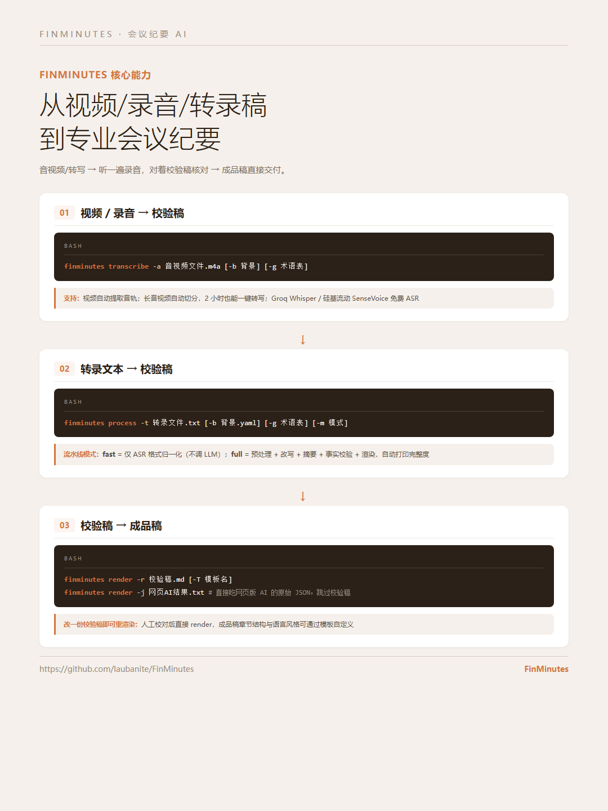
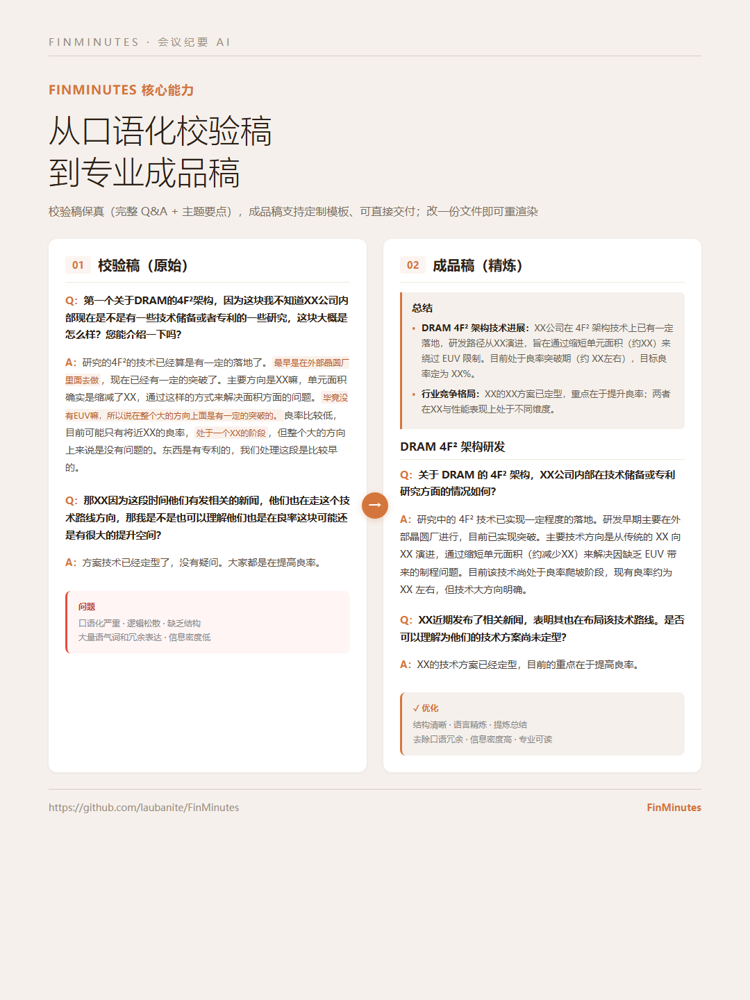
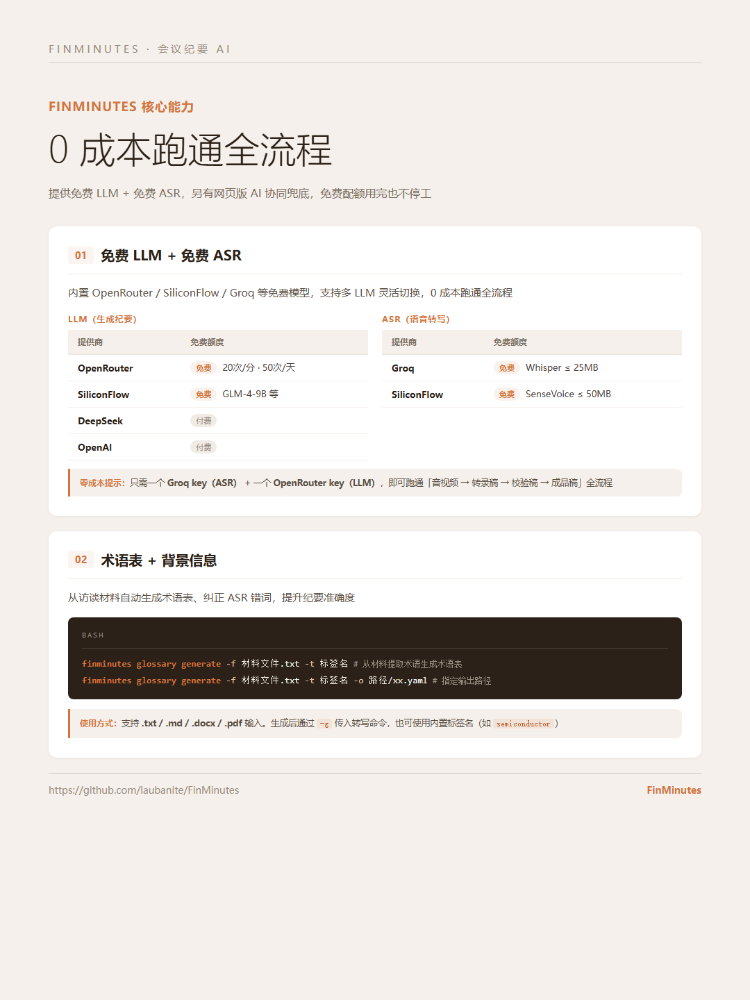
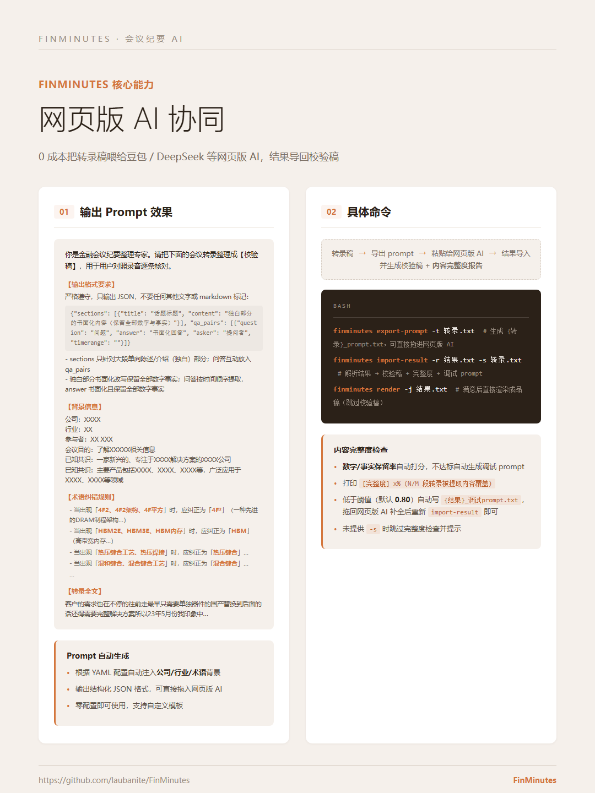

<div align="center">

# FinMinutes

[](https://opensource.org/licenses/MIT) [](https://www.python.org/downloads/) [](https://fastapi.tiangolo.com/) [](https://www.orcarouter.ai/ref/ref_fc88ee354797b100a58a)

**An AI agent for financial meeting minutes — a one-stop pipeline from video / audio / raw transcripts to professional, deliverable minutes.**

**Free LLM + free ASR, one command end to end. Built for the people who do this by hand.**

[Intro](#intro) • [Showcase](#showcase) • [Features](#features) • [Installation](#installation) • [Quick Start](#quick-start) • [Free API Keys](#free-api-keys) • [Commands](#commands) • [License](#license)

<p align="center">
<a href="README.md">中文</a> | English
</p>

</div>

## Intro

FinMinutes targets investment research, due diligence, roadshows and expert interviews, turning **video / audio / transcripts** into professional minutes in one command.

**The problem**: listening back through a single interview, transcribing it word for word, rewriting it into written prose and re-checking every number takes half a day. FinMinutes compresses that into three steps — **transcribe/import → listen once and verify against the review draft → deliver the final draft**.

**Why it exists**: in finance, **numbers are facts, and a wrong one costs money**. Generic AI notetakers transcribe well, but nothing in them is designed for *numeric fidelity* or *deliverability* — those two are exactly where FinMinutes focuses.

**Core advantages**:

- **Runs free end-to-end** — free LLM + free ASR, with a web-AI loop as fallback so you never stop when free quotas run out
- **Numbers are never lost** — a deterministic content-completeness check scores number/fact retention; below threshold it auto-writes a debug prompt so you can iterate to full coverage
- **Two-draft loop** — the review draft is for verification (full Q&A + topic points), the final draft is for delivery; edit one file and re-render

## Showcase

> The cards below are in Chinese (they double as our product-marketing assets). The pipeline and the numbers are identical in either language.

<table>
  <tr>
    <td width="50%"></td>
    <td width="50%"></td>
  </tr>
  <tr>
    <td align="center"><b>1. The pipeline</b>: video / audio → transcript → review draft → final draft</td>
    <td align="center"><b>2. Two-draft loop</b>: verify against the review draft, ship the final draft</td>
  </tr>
  <tr>
    <td></td>
    <td></td>
  </tr>
  <tr>
    <td align="center"><b>3. Zero cost</b>: free LLM + free ASR, ~16 LLM calls per meeting</td>
    <td align="center"><b>4. Quota fallback</b>: when the free tier is spent, hand off to web AI and keep going</td>
  </tr>
</table>

## Features

- **Two-draft loop** — fidelity review draft + deliverable final draft; edit one file, re-render
- **Speech-to-text** — free Groq Whisper / SiliconFlow SenseVoice; audio auto-extracted from video; long files auto-chunked
- **Web-AI loop** — zero cost: export a prompt pack, paste it into Doubao / DeepSeek web AI, import the result back
- **Completeness check** — deterministic number/fact retention scoring (no LLM involved); auto-writes a debug prompt when below threshold
- **Multiple LLMs** — free tier first with automatic fallback on rate limits; supports Anthropic / any OpenAI-compatible endpoint (e.g. OrcaRouter)
- **Glossary + background context** — generate term glossaries from interview materials, correct ASR misrecognitions
- **ASR format normalization** — transcripts from Feishu Minutes / iFlytek / Whisper and others work as-is
- **Custom templates** — final-draft section structure and register are configurable
- **Zero learning curve** — `finminutes --help` plus interactive guidance at every step

## Installation

Requirements: Python 3.10+, [ffmpeg](https://ffmpeg.org/) (needed for audio extraction from video / chunking of large files)

### Install from pip

Install **Python 3.10+** first ([download](https://www.python.org/downloads/)), then:

```bash
pip install finminutes
```

### Install from source

```bash
git clone https://github.com/laubanite/FinMinutes
cd FinMinutes
pip install -r requirements.txt
pip install -e .
```

### Lazy install: let an agent do it

Rather than doing this by hand, paste the following to Claude Code / Codex / opencode / WorkBuddy or any other AI agent, and it will handle the whole setup:

> Please install and configure finminutes, an AI meeting-minutes tool (https://github.com/laubanite/FinMinutes), including ffmpeg. Verify that `finminutes --help` runs correctly, then tell me what to do next.

### Installing ffmpeg

ffmpeg is used for **extracting audio from video** and **chunking large files** (when audio exceeds the ASR provider limit: Groq 25MB / SiliconFlow 50MB). Pick your platform:

**Windows:**

```powershell
# Option 1 (recommended): one-shot install via winget
winget install Gyan.FFmpeg

# Option 2: manual download
#   1. Grab a release archive from https://www.gyan.dev/ffmpeg/builds/
#   2. Extract it to a local folder (e.g. C:\ffmpeg)
#   3. Add the bin folder to PATH:
#      Settings → System → Advanced system settings → Environment Variables → Path → New → C:\ffmpeg\bin
```

**macOS:**

```bash
brew install ffmpeg
```

**Linux:**

```bash
# Debian / Ubuntu
sudo apt update && sudo apt install ffmpeg

# CentOS / RHEL
sudo yum install ffmpeg
```

> After installing, **reopen your terminal** so the new PATH takes effect before running the commands again.

## Free API Keys

FinMinutes runs end-to-end at zero cost: free-tier LLM + free ASR providers. Below is how to register and get a key for each. All keys can be entered interactively via `finminutes init` (recommended), or set as environment variables (see [Quick Start](#quick-start)).

### LLM (minutes generation)

| Provider | Free tier | How to get a key |
| --- | --- | --- |
| [**OpenRouter**](https://openrouter.ai) (default, recommended) | Free models available; free tier: 20 req/min, 50 req/day | Sign up at [openrouter.ai](https://openrouter.ai) → avatar (top right) → Keys → Create Key |
| [**OrcaRouter**](https://www.orcarouter.ai/ref/ref_fc88ee354797b100a58a) | Multi-model gateway, pay-as-you-go (see website for pricing) | Sign up at [orcarouter.ai](https://www.orcarouter.ai/ref/ref_fc88ee354797b100a58a) → API Keys → Create |
| [**SiliconFlow**](https://cloud.siliconflow.cn) | Free models (e.g. GLM-4-9B) | Sign up at [cloud.siliconflow.cn](https://cloud.siliconflow.cn) → Console → API Keys → New |
| [**DeepSeek**](https://platform.deepseek.com/api_keys) | Paid | Sign up at [platform.deepseek.com](https://platform.deepseek.com/api_keys) → API Keys → Create |
| [**OpenAI**](https://platform.openai.com) | Paid | [platform.openai.com](https://platform.openai.com) → API Keys → Create |

### ASR (speech-to-text)

| Provider | Free tier | How to get a key |
| --- | --- | --- |
| [**Groq**](https://console.groq.com) (default, recommended) | Whisper free, files ≤ 25MB | Sign up at [console.groq.com](https://console.groq.com) → API Keys → Create API Key |
| **SiliconFlow** | SenseVoiceSmall free, files ≤ 50MB | Same as above (one SiliconFlow account/key serves both LLM and ASR) |

> **Zero-cost tip**: to run the whole flow you need exactly two keys — **Groq (ASR) + OpenRouter (LLM)** — and you get audio → transcript → review draft → final draft. When free quotas run out, the web-AI loop (`export-prompt` / `import-result`) is a fully free, unlimited fallback.

## Quick Start

### 1. Initialize configuration

```bash
finminutes init
```

Interactively pick an LLM provider and enter your API key. Config is saved to `~/.finminutes/config.yaml` (never written into the project directory).

> You can also set environment variables directly: `${OPENROUTER_API_KEY}`, `${DEEPSEEK_API_KEY}`, `${OPENAI_API_KEY}`, `${ANTHROPIC_API_KEY}`, `${GROQ_API_KEY}`, `${SILICONFLOW_API_KEY}`

### 2. Generate minutes

```bash
# Option 1: from a transcript you already have
finminutes process -t transcript.txt

# Option 2: from audio/video (speech-to-text + minutes in one go; audio extracted from video automatically)
finminutes transcribe -a meeting.m4a

# Option 3: transcribe first, then generate minutes separately
finminutes transcribe -a meeting.m4a --no-process
finminutes process -t meeting_transcript.txt
```

What you get:

| Artifact | Path | Description |
| --- | --- | --- |
| Transcript | `{stem}_转录稿.txt` | Raw speech-to-text output |
| Cleaned draft | `{stem}_清洗稿.txt` | Plain text after ASR format normalization (`fast` mode) |
| Review draft | `{stem}_校验稿.md` | Fidelity draft: full Q&A + topic points, for verification |
| Final draft | `{stem}_成品稿.md` | Written, structured, ready to deliver |

> File names keep their Chinese suffixes — that is literally what the tool writes to disk. `{stem}` is the input file's base name.

### Output example (anonymized)

Below is a review draft and a final draft generated from the same interview. The content is fictional and anonymized (companies, technical details and figures are masked as `XX`; real output preserves the original numbers).

**Note**: the samples stay in Chinese because that is the language the tool produces output in — FinMinutes is built for Chinese-language financial interviews. Translating the samples would misrepresent what it actually emits.

**Review draft** — maximally faithful to the transcript: full Q&A and topic points preserved, numbers kept verbatim, so you can check it line by line against the recording. The YAML frontmatter carries the structured pairs (`question` / `answer` / `asker` / `timerange`), followed by the readable body:

```
---
qa_pairs:
- question: 第一个关于新一代产品架构，因为这块我不知道XX公司内部现在是不是有一些技术储备或者专利的一些研究，这块大概是怎么样？您能介绍一下吗？
  answer: 研究的新一代架构已经算是有一定的落地了。最早是在外部晶圆厂里面去做，现在已经有一定的突破了。主要方向是从传统架构演进，单元面积确实是缩减了约 XX，通过这样的方式来解决面积方面的问题。毕竟没有先进工艺嘛，所以说在整个大的方向上面是有一定的突破的。良率比较低，目前可能只有将近 XX% 的良率，处于一个没有量产的阶段，但整个大的方向上来说是没有问题的。东西是有专利的，我们处理这段是比较早的。
  asker: 提问者
  timerange: ''
- question: 那XX因为这段时间他们有发相关的新闻，他们也在走这个技术路线方向，那我是不是也可以理解他们也是在良率这块可能还是有比较大的提升空间，而不是说底层的技术方案还没有定型？
  answer: 方案技术已经定型了，没有疑问。大家都是在提高良率。
  asker: 提问者
  timerange: ''
- question: XX他们因为他们有先进工艺嘛，他们在有先进工艺的情况下，是不是他们的新一代架构方案会比国内这几家会有更优的一些密度、什么各方面一些性能指标？
  answer: 本来不是一个维度，不是一个等级的。密度来说他们只是为了提高上限，而我们是为了通过工艺的限制来跟他们达到同样的制程角度。他们在同样的尺寸的密度上面上限更高，而且性能更优，不是在一个游戏里面去做的。
  asker: 提问者
  timerange: ''
- question: 既然咱们现在也是能够绕开先进工艺的方案，先天来说成本和良率可能会有一些区别。咱们的，因为现在方案定了，咱们的目标良率大概会在多少？
  answer: 目标良率大概是在XX%。
  asker: 提问者
  timerange: ''
- question: 有预计几年能够实现吗？比如说三年还是怎么样？因为我们看XX什么都把新一代架构的量产时间往后挪了。
  answer: 当然需要，最起码需要X到X年左右的时间，这个周期是非常长的，没办法的。
  asker: 提问者
  timerange: ''
- question: 您介绍说是早期是在外部晶圆厂做，现在是回到咱们自己的产线做了？
  answer: 没错。
  asker: 提问者
  timerange: ''
- question: 第三个现在咱们目前高端产品的整体的进度是怎么样？因为我们也有看一些公开信息，说应该是新一代产品是马上要上了，还是怎么样？
  answer: XX是已经量产的。XX今年已经能出，接下来慢慢的就会往XX方向走。如果未来新一代架构的技术比较成熟，也有可能会通过像XX这些技术，可能需要一些时间的。
  asker: 提问者
  timerange: ''
- question: 现在咱们主要是给谁供货，或者说有一些潜在的客户是国内的还是海外的？
  answer: ''
  asker: 提问者
  timerange: ''
---
# 校验稿

**Q**：第一个关于新一代产品架构，因为这块我不知道XX公司内部现在是不是有一些技术储备或者专利的一些研究，这块大概是怎么样？您能介绍一下吗？
**A**：研究的新一代架构已经算是有一定的落地了。最早是在外部晶圆厂里面去做，现在已经有一定的突破了。主要方向是从传统架构演进，单元面积确实是缩减了约 XX，通过这样的方式来解决面积方面的问题。毕竟没有先进工艺嘛，所以说在整个大的方向上面是有一定的突破的。良率比较低，目前可能只有将近 XX% 的良率，处于一个没有量产的阶段，但整个大的方向上来说是没有问题的。东西是有专利的，我们处理这段是比较早的。

**Q**：那XX因为这段时间他们有发相关的新闻，他们也在走这个技术路线方向，那我是不是也可以理解他们也是在良率这块可能还是有很大的提升空间，而不是说底层的技术方案还没有定型？
**A**：方案技术已经定型了，没有疑问。大家都是在提高良率。

**Q**：XX他们因为他们有先进工艺嘛，他们在有先进工艺的情况下，是不是他们的新一代架构方案会比国内这几家会有更优的一些密度、什么各方面一些性能指标？
**A**：本来不是一个维度，不是一个等级的。密度来说他们只是为了提高上限，而我们是为了通过工艺的限制来跟他们达到同样的制程角度。他们在同样的尺寸的密度上面上限更高，而且性能更优，不是在一个游戏里面去做的。

**Q**：既然咱们现在也是能够绕开先进工艺的方案，先天来说成本和良率可能会有一些区别。咱们的，因为现在方案定了，咱们的目标良率大概会在多少？
**A**：目标良率大概是在XX%。

**Q**：有预计几年能够实现吗？比如说X年还是怎么样？因为我们看XX什么都把新一代架构的量产时间往后挪了。
**A**：当然需要，最起码需要X到X年左右的时间，这个周期是非常长的，没办法的。

**Q**：您介绍说是早期是在外部晶圆厂做，现在是回到咱们自己的产线做了？
**A**：没错。

**Q**：第三个现在咱们目前高端产品的整体的进度是怎么样？因为我们也有看一些公开信息，说应该是新一代产品是马上要上了，还是怎么样？
**A**：XX是已经量产的。XX今年已经能出，接下来慢慢的就会往XX方向走。如果未来新一代架构的技术比较成熟，也有可能会通过像XX这些技术，可能需要一些时间的。
```

**Final draft** — the LLM refines the review draft into written, structured prose, keeping every Q&A pair and every number:

```
## 总结

- **新一代架构技术进展**：XX公司在新一代架构技术上已有一定落地，研发路径从传统架构演进，旨在通过缩短单元面积（约 XX）来绕开先进工艺的限制。目前该技术已从外部晶圆厂转向自有产线研发，现阶段处于良率突破期（约 XX% 左右），目标良率定为 XX%。预计实现量产规模化需要约 X 至 X 年的周期。
- **行业竞争格局**：XX的方案已定型，重点在于提升良率；而国内厂商通过该方案旨在应对工艺差距，以达到同等制程水平，两者在密度与性能表现上处于不同维度。
- **高端产品进度**：公司已实现 XX 量产。预计今年可实现新一代产品的产出，后续将逐步向 XX 演进。若新一代架构技术趋于成熟，未来有望实现 XX 等更高阶技术的突破。

## Q&A

### 新一代产品架构研发

**Q：关于新一代产品架构，XX公司内部在技术储备或专利研究方面的情况如何？**
A：研究中的新一代架构技术已实现一定程度的落地。研发早期主要在外部晶圆厂进行，目前已实现突破。主要技术方向是从传统架构演进，通过缩短单元面积（约减少 XX）来解决缺乏先进工艺带来的制程问题。目前该技术尚处于良率爬坡阶段，现有良率约为 XX% 左右，但技术大方向明确。公司在这一领域的专利储备较早。

**Q：XX近期发布了相关新闻，表明其也在布局该技术路线。是否可以理解为他们的技术方案尚未定型，而是主要面临良率提升的空间？**
A：XX的技术方案已经定型，目前的重点在于提高良率。

**Q：由于XX拥有先进工艺，其新一代架构方案在密度指标上是否会优于国内厂商？**
A：两者并不在同一维度竞争。XX通过先进工艺提升的是密度上限；而国内厂商采用该方案是为了在缺乏该工艺的情况下，达到与他们相同的制程水平。即在同等尺寸下，XX的密度更高且性能更优。

**Q：既然国内方案是为了绕开先进工艺，那么在成本和良率方面是否存在差异？在方案已定的情况下，目标良率是多少？**
A：目标良率约为 XX%。

**Q：实现目标良率预计需要多少年？是否参考XX推迟量产的时间节点？**
A：预计至少需要 X 到 X 年的时间，由于技术周期较长，难以速成。

**Q：此前提到该技术早期在外部晶圆厂进行，目前是否已转入自有产线？**
A：是的，目前已回到自有产线进行研发。
```

> What this demonstrates: the **review draft** stays faithful — full Q&A and topic points, numbers untouched, so you can verify against the recording. The **final draft** is the LLM's written, structured refinement of it: the number of Q&A pairs is conserved and every figure is carried through verbatim. You never need to re-listen word for word — spot-checking the review draft is enough.

## Commands

Every command ships with built-in help. **Run `finminutes --help` first to see all commands, then `finminutes <command> --help` for the parameters of the one you care about** — the prompts will walk you through the rest:

```bash
finminutes --help                 # list all commands and what they do
finminutes init --help            # init options
finminutes process --help         # process options
finminutes transcribe --help      # transcribe options
finminutes render --help          # render options
finminutes config --help          # config subcommands
finminutes glossary --help        # glossary subcommands
```

Command overview (in workflow order):

| Command | What it does | Typical usage |
| --- | --- | --- |
| `config` | Configuration management (view/switch model & ASR) | `finminutes config show` |
| `init` | Interactive setup wizard | `finminutes init` |
| `glossary` | Glossary management | `finminutes glossary generate -f material.txt -t tag` |
| `transcribe` | Speech-to-text, can produce the review draft directly | `finminutes transcribe -a audio.m4a` |
| `process` | Transcript → review draft | `finminutes process -t transcript.txt` |
| `render` | Review draft → final draft | `finminutes render -r review.md` |
| `export-prompt` | Export a web-AI prompt pack | `finminutes export-prompt -t transcript.txt` |
| `import-result` | Import web-AI result and report completeness | `finminutes import-result -r result.txt -s transcript.txt` |

### `finminutes init`

Interactive setup wizard. It walks you through **LLM** (minutes post-processing) and **ASR** (speech-to-text) providers in two steps: pick provider → enter API key → test connection (both LLM and ASR get a lightweight validation). `--force` re-runs the wizard.

- The provider list is **driven by your config, not hardcoded**: built-in presets plus anything you added with `config add` all show up; if what you want isn't there, choose "manual configuration" to enter the custom wizard.
- Menu labels stay compact: free providers are marked "free" + the currently configured model name + rate-limit info (all read from config, never hardcoded); paid providers show only the model name, with no verbose descriptions.
- Writes are **minimal**: only the provider and key you choose are written; every advanced parameter keeps its factory default.
- At the end it prints where the advanced knobs live (`config set <dotted.path>` / `config add` / `config remove`) and a **config-layering reminder** (it reads `~/.finminutes/config.yaml` first; the project's `finminutes/config.yaml` holds defaults only).

### `finminutes config add` (two tiers)

A built-in preset name (e.g. `groq` / `openrouter_free` / `anthropic`, already defined in the factory config) → **you only enter an API key**. A brand-new name → the full-parameter wizard (including advanced options such as `max_file_size_mb` and chunk duration). For custom LLM providers, pick one of two API formats: **OpenAI-compatible** (default) / **Anthropic**.

### `finminutes config remove`

Deletes a user-defined provider (useful for cleaning up leftovers, e.g. an ollama entry baked into an early config): `finminutes config remove llm ollama`. Built-in presets cannot be deleted (they are restored from factory defaults on load); you cannot delete the currently active provider, nor the last remaining one.

### `finminutes process`

Generates a review draft from transcript text.

```bash
finminutes process -t transcript.txt [-b background.yaml] [-g glossary] [-m mode] [-o output]
```

| Option | Description |
| --- | --- |
| `-t, --transcript` | Path to the transcript file (required) |
| `-b, --background` | Path to a background-context YAML file |
| `-g, --glossary` | Path to a glossary YAML file, or a built-in tag name (e.g. `semiconductor`) |
| `-m, --mode` | Pipeline mode: `fast` / `full` (default `full`) |
| `-o, --output` | Output prefix or directory path |

**Pipeline modes:**

| Mode | Stages | LLM calls | Output |
| --- | --- | --- | --- |
| `fast` | Preprocessing only (ASR format normalization) | No | `{stem}_清洗稿.txt` |
| `full` | Preprocess + rewrite + summarize + fact-check + render | Yes (rewrite + summarize) | `{stem}_校验稿.md`, plus a coverage report printed |

**`-o` output path rules:**

| Value of `-o` | Output location |
| --- | --- |
| omitted | `{transcript dir}/{stem}_校验稿.md` |
| `output/` | `output/{stem}_校验稿.md` |
| `meeting_final` | `{transcript dir}/meeting_final_校验稿.md` |
| `output/meeting_final` | `output/meeting_final_校验稿.md` |

### `finminutes transcribe`

Speech-to-text, with optional automatic review-draft generation.

```bash
finminutes transcribe -a audio.m4a [--no-process] [-b background] [-g glossary] [-o output]
```

| Option | Description |
| --- | --- |
| `-a, --audio` | Path to the audio file (.mp3/.wav/.m4a etc.) (required) |
| `--no-process` | Transcribe only; do not auto-generate the review draft |
| `-b, --background` | Path to a background-context YAML file |
| `-g, --glossary` | Path to a glossary YAML file, or a built-in tag name (e.g. `semiconductor`) |
| `-o, --output` | Output prefix or directory path |

**Switching ASR provider:**

```bash
finminutes config show                          # inspect current configuration
finminutes config set active_asr groq           # switch to Groq (default)
finminutes config set active_asr siliconflow    # switch to SiliconFlow
```

**Large-file chunking:** when audio exceeds the active provider's limit, it is automatically chunked and transcribed in parts (Groq 25MB / SiliconFlow 50MB; both adjustable in config), with chunking progress displayed. Chunking requires ffmpeg on the system.

### `finminutes render`

Renders a final draft from a review draft (calls the LLM to refine).

```bash
finminutes render -r review.md [-T template] [-o output]
finminutes render -j web_ai_result.txt          # feed raw web-AI JSON directly, skipping the review-draft format
```

| Option | Description |
| --- | --- |
| `-r, --review` | Path to the review draft (mutually exclusive with `-j`; one of the two is required) |
| `-j, --json` | Raw JSON returned by a web AI, rendered straight into a final draft (mutually exclusive with `-r`; one of the two is required) |
| `-T, --template` | Final-draft template name (default `default`) |
| `-o, --output` | Output prefix or directory path |

### `finminutes export-prompt` / `import-result` (web-AI loop, zero cost)

Transcript → export a prompt → paste it into a web AI (Doubao / DeepSeek etc.) → import the result to produce a review draft plus a **content-completeness report**.

```bash
finminutes export-prompt -t transcript.txt      # writes {transcript}_prompt.txt, ready to drag into a web AI
finminutes import-result -r result.txt -s transcript.txt   # parse result → review draft + completeness + debug prompt
finminutes render -j result.txt                 # once satisfied, render the final draft directly (skips the review draft)
```

The completeness check in `import-result` is a **deterministic number/entity retention rate** (zero LLM calls):

- Prints `[完整度] X% (N/M transcript segments covered by the extracted content)`;
- Below the threshold (`coverage_threshold`, default **0.80**) it automatically writes `{result}_调试prompt.txt`, containing what has already been extracted plus the uncovered transcript fragments — drag that back into the web AI to fill the gaps, then run `import-result` again;
- If `-s` is not supplied, the completeness check is skipped and you are told so.

> **Config-layering reminder**: the config that actually takes effect is `~/.finminutes/config.yaml`; the `finminutes/config.yaml` in the repo is only the *factory defaults* and is overridden by user config. To change a threshold use `finminutes config set coverage_threshold 0.8` (it writes to the right place) — do not edit the repo config directly.

### `finminutes config`

Configuration management.

```bash
finminutes config show                 # print the active configuration (API keys masked)
finminutes config set KEY VALUE        # dotted paths supported, e.g. asr_providers.groq.max_file_size_mb 50
finminutes config add llm/asr NAME     # add/configure a provider (presets ask for a key only; custom runs the full wizard)
finminutes config remove llm/asr NAME  # delete a user-defined provider (e.g. clean up a leftover ollama)
finminutes config list-providers       # list all LLM providers
```

### `finminutes glossary`

Glossary management.

```bash
finminutes glossary generate -f material.txt -t tagname            # extract terms from material into a glossary (defaults to ./tagname.yaml)
finminutes glossary generate -f material.txt -t tagname -o path/xx.yaml  # choose an output path, then pass it via -g
```

Accepts `.txt` / `.md` / `.docx` / `.pdf` input.

The `-g` flag takes either a **glossary YAML file path** (the file may live anywhere, e.g. `-g D:\project\glossary.yaml`) or a **built-in tag name** (e.g. `-g semiconductor`, the default glossary shipped with the package).

## Configuration

All configuration lives in `~/.finminutes/config.yaml` (generated by `init`, or the built-in project defaults at `finminutes/config.yaml` are used when that file is absent).

```yaml
active_llm: openrouter_free
active_asr: groq

llm_providers:
  openrouter_free:
    provider: openrouter
    api_key: "${OPENROUTER_API_KEY}"          # environment-variable placeholder
    model: google/gemini-2.0-flash-lite-preview-02-05
  deepseek: ...
  openai: ...
  siliconflow: ...

asr_providers:
  groq:
    provider: groq
    api_key: "${GROQ_API_KEY}"
    model: whisper-large-v3-turbo
    max_file_size_mb: 25        # auto-chunk above this size
    chunk_duration_minutes: 10  # length of each chunk
    overlap_seconds: 5          # overlap between chunks
    max_retries: 3              # retries per chunk
  siliconflow:
    provider: siliconflow
    api_key: "${SILICONFLOW_API_KEY}"
    model: FunAudioLLM/SenseVoiceSmall
    max_file_size_mb: 50
```

## Background Context File

The background YAML passed via `-b` supplies meeting context so the LLM produces sharper minutes. See `finminutes/data/backgrounds/example.yaml`:

```yaml
company: "某半导体设计公司"
industry: "半导体"
participants: "CEO 张总，CFO 李总"
known_consensus:
  - "公司计划明年申报科创板"
  - "高端存储业务预计明年放量"
meeting_purpose: "Q3 业绩展望及新产品路线图"
```

## Project Structure

```
finminutes/
├── cli.py                    # CLI entry point (init/process/transcribe/render/config/glossary)
├── config.yaml               # built-in defaults (env-var placeholders only, safe to publish)
├── api/                      # FastAPI HTTP service (serve command)
├── core/
│   ├── pipeline.py           # pipeline orchestration
│   ├── preprocessor.py       # preprocessing
│   ├── rewriter.py           # rewriting
│   ├── summarizer.py         # structured summarization
│   ├── fact_checker.py       # fact checking
│   ├── renderer.py           # Markdown rendering
│   ├── asr_client.py         # ASR client (Groq / SiliconFlow)
│   ├── config_manager.py     # configuration management
│   ├── glossary_loader.py    # glossary loading
│   ├── background_loader.py  # background context loading
│   └── ...
├── data/
│   ├── backgrounds/          # background-context examples
│   └── glossary/             # glossaries
├── templates/                # minutes templates
└── tests/                    # tests
```

## Development

```bash
pip install -r requirements.txt
pytest tests/ -q
```

## License

MIT
